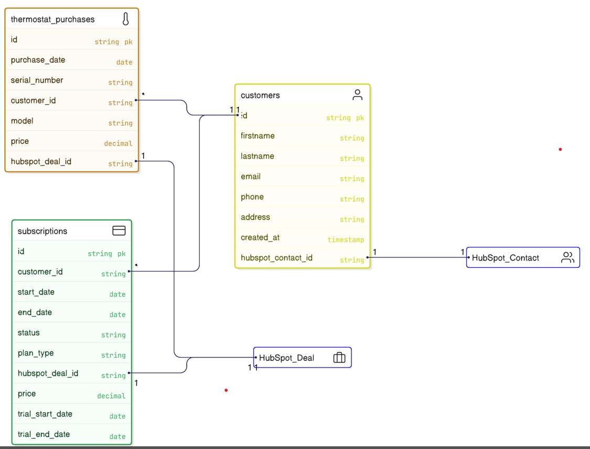
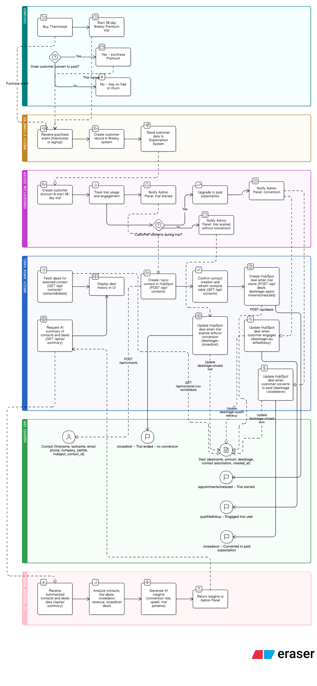

# HubSpot Integration Backend - Breezy Technical Assessment

This project is my submission for the HubSpot Solutions Architect Technical Assessment.
It includes a backend server (provided in starter) and a full working frontend that demonstrates how Breezy, a smart thermostat company, could integrate their platform with HubSpot CRM.

Along with all required endpoints, I have also implemented the optional AI Insights feature, which generates smart summaries of HubSpot contacts and deals using OpenAI.

## A. Setup Instructions
### Dependencies / Prerequisites

- Node.js (v14 or higher)
- npm or yarn
- A HubSpot account (free)
- A HubSpot Private App access token
- (Optional) OpenAI API key for AI Insights feature

### Setup 

### 1. Install Dependencies

```bash
npm install
```
This installs Express, Axios, CORS, nodemon (dev), and OpenAI SDK.

### 2. Get Your HubSpot Access Token

1. Sign in to your HubSpot account
2. Navigate to Settings → Integrations → Private Apps
3. Click Create a private app
4. Give it any name (e.g., Breezy Integration App)
5. Open the Scopes tab and enable:
   - crm.objects.contacts.read
   - crm.objects.contacts.write
   - crm.objects.deals.read
   - crm.objects.deals.write
6. Click Create
7. Copy the private app access token

This token is used by the backend to authenticate all CRM requests.

### 3. Configure Environment Variables

Copy the example env file:

cp .env.example .env


Open .env and set:

HUBSPOT_ACCESS_TOKEN=your-hubspot-token-here
OPENAI_API_KEY=your-openai-api-key-here # Optional, required for AI Insights


Notes:

- No quotes around the API keys
- Do not commit .env to GitHub

### 4. Start the Server
**For development (with hot-reloading):**

```bash
npm run dev
```

Open the UI:

http://localhost:3001/

This will automatically restart the server when you make changes to `server.js`.

**For production:**

```bash
npm start
```

You should see:

```
✅ Server running successfully!
🌐 API available at: http://localhost:3001
📋 Health check: http://localhost:3001/health
📁 Static files served from: /public
```

**To stop the server:** Press `Ctrl+C` (the server will gracefully shut down)

### 5. Test the Server

Open:

http://localhost:3001/health


or run:

curl http://localhost:3001/health


Expected response:

{
  "status": "Server is running",
  "timestamp": "2025-11-10T..."
}

### How to test the integration flow (end-to-end)

1. Start the server:
   ```bash
   npm run dev
   ```
2. Open the UI:
    - http://localhost:3001/
3. Confirm contacts auto-load from HubSpot
4. Create / sync a contact using the form
5. Create a subscription deal linked to that contact
6. Click “View deals” to confirm the deal association appears
7. (Optional) Click “Generate AI summary / insights” to verify AI Insights output

## B. Project Overview

This proof-of-concept (POC) demonstrates how **Breezy** (a smart thermostat company) could integrate their platform with **HubSpot CRM** to:

- **Sync customers into HubSpot Contacts** (simulate account creation / thermostat purchase)
- **Track subscription conversions using HubSpot Deals** (simulate upgrade to Breezy Premium)
- **Associate deals to contacts** to see subscription history per customer
- **View deals linked to a specific contact** from the UI
- **(Optional)** Generate an **AI summary** of CRM activity (contacts + deals + revenue patterns)

The included UI (`/public/index.html`) acts like a lightweight internal admin panel for testing the flows end-to-end.


## Frontend Application (UI Overview)

A complete frontend UI is included in `/public/index.html`.  
It automatically loads when you open:

http://localhost:3001/

This UI simulates Breezy’s internal admin dashboard and uses the backend API to perform all operations required in the assessment.

### ✔ View Contacts (Auto-loaded from HubSpot)

The UI loads all HubSpot contacts automatically when you open the dashboard.

It calls:

GET /api/contacts

The table shows:
- First name  
- Last name  
- Email  
- Job title  
- Company  
- Contact ID  
- A **View deals** button

---

### ✔ Create / Sync Contact

This simulates when a Breezy customer creates an account or purchases a thermostat.

It calls:

POST /api/contacts

Fields in the form:
- First name  
- Last name  
- Email  
- Phone (optional)  
- Address (optional)  
- Job title (optional)  
- Company (optional)

After submitting:
- The contact is created in HubSpot  
- A success message appears  
- The contacts list refreshes

---

### ✔ Create Subscription Deal

This simulates when a user upgrades to Breezy Premium.

It calls:

POST /api/deals

Form fields:
- Contact (dropdown populated from HubSpot)
- Deal name
- Amount
- Deal stage (closedwon, appointmentscheduled, qualifiedtobuy, closedlost)

After submitting:
- The deal is created  
- It is linked to the selected contact  
- Success message appears

---

### ✔ View Deals for a Contact

When clicking **View deals**, the UI calls:

GET /api/contacts/:contactId/deals

This shows:
- Deal ID  
- Deal name  
- Amount  
- Deal stage  

This helps track subscription history per customer.

---

### ✔ AI Insights (Optional Feature)

This optional feature uses OpenAI to analyze CRM data.

It calls:

GET /api/ai/summary

The AI section displays:
- Number of contacts  
- Number of deals  
- Total revenue  
- Interesting patterns  
- Insights about customer behavior

## C. AI Usage Documentation

### Which AI tools were used?
- ChatGPT (development assistance and troubleshooting)
- OpenAI API (used in the optional AI Insights endpoint)

### What tasks was AI used for?
- Designing the prompt for the AI summary (contacts + deals + revenue patterns)
- Structuring AI output so it displays cleanly in the UI
- Troubleshooting integration issues (scopes, payload formats, associations)
- Drafting/structuring README documentation to match assessment requirements

### What did you learn / what was challenging?
- Correctly associating Deals to Contacts in HubSpot is critical for reporting and “View Deals”
- Deal stages must match valid HubSpot pipeline stage values
- AI output needs guardrails (format + scope) to stay concise and useful

### How did AI help (or not help)?
- Helped speed up iteration on prompt design and debugging
- Manual validation in HubSpot UI was still required to confirm correct behavior

## D. HubSpot Data Architecture

### Entity Relationship Diagram (ERD)


**Core objects used in this POC**
- **Contact**: Breezy customer identity and profile
- **Deal**: Subscription conversion / subscription event

**Relationship**
- **Contact (1) → Deal (Many)**  
  One customer can have multiple deals over time (upgrades, renewals, retries).

### Deal Pipeline Architecture


**Deal stage mapping used in this POC**
- `appointmentscheduled` → Trial started
- `qualifiedtobuy` → Active trial user
- `closedwon` → Converted to paid subscription
- `closedlost` → Trial ended without conversion

## E. [Optional] AI Feature Explanation

### Describe your AI-powered feature
The optional AI feature (`GET /api/ai/summary`) generates a natural-language summary of HubSpot contacts and deals, including totals, estimated revenue from deal amounts, and simple patterns (e.g., deal stage distribution).

### Why did you choose this feature?
It demonstrates how Breezy can go beyond “syncing data” and quickly generate insights for sales/marketing without manually reviewing CRM records.

### How does it make the integration smarter?
It converts synced CRM data into:
- A readable summary for non-technical stakeholders
- Highlights of conversion and revenue patterns
- Quick “health checks” on pipeline activity

### When would you use AI vs traditional rules/logic?
- Use **rules/logic** for deterministic workflows (alerts, triggers, compliance, exact calculations).
- Use **AI** for summarization, trend/pattern highlighting, and advisory insights where output is interpretive.

## F. Design Decisions

### Technical choices you made and why
- Express proxy backend to keep HubSpot access tokens server-side
- Static frontend in `/public` for fast POC delivery without build tooling
- Using HubSpot Contacts and Deals as the minimum viable CRM model
- Optional OpenAI summarization to demonstrate AI-powered insights on CRM data

### Assumptions about Breezy's platform
- Breezy is the system of record for customer accounts and subscriptions
- HubSpot is primarily used by sales and marketing teams
- Customers may have multiple subscription-related deals over time

### What you'd improve with more time
- Add pagination and search for contacts and deals
- Add a custom object to represent thermostat hardware
- Improve UI validation and error messaging
- Add reporting fields to support ARR/MRR and churn analysis

### What you'd ask the client before building production version
- What is the true source of truth for subscriptions?
- Which lifecycle events matter (trial start/end, renewals, cancellations)?
- What reporting is required (MRR, churn, conversion)?
- What data governance and consent requirements apply?

## Project Structure

```
hs-solution-architect-tech-assessment/
│
├── server.js
├── README.md
├── .env.example
├── package.json
├── package-lock.json
├── public/
│   └── index.html
└── node_modules/

```


